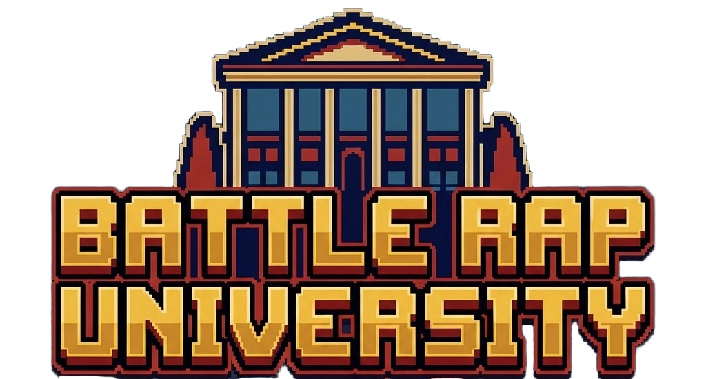
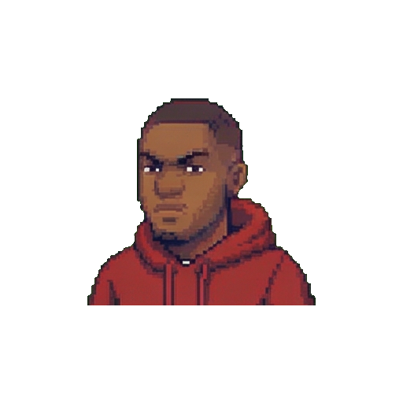
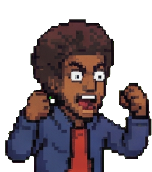
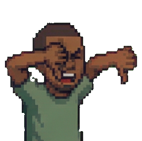
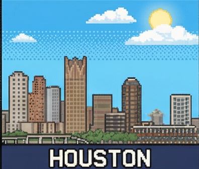
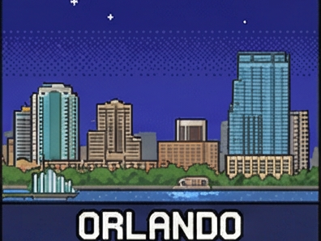
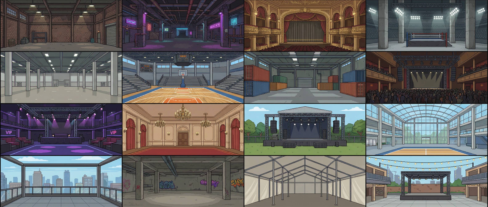
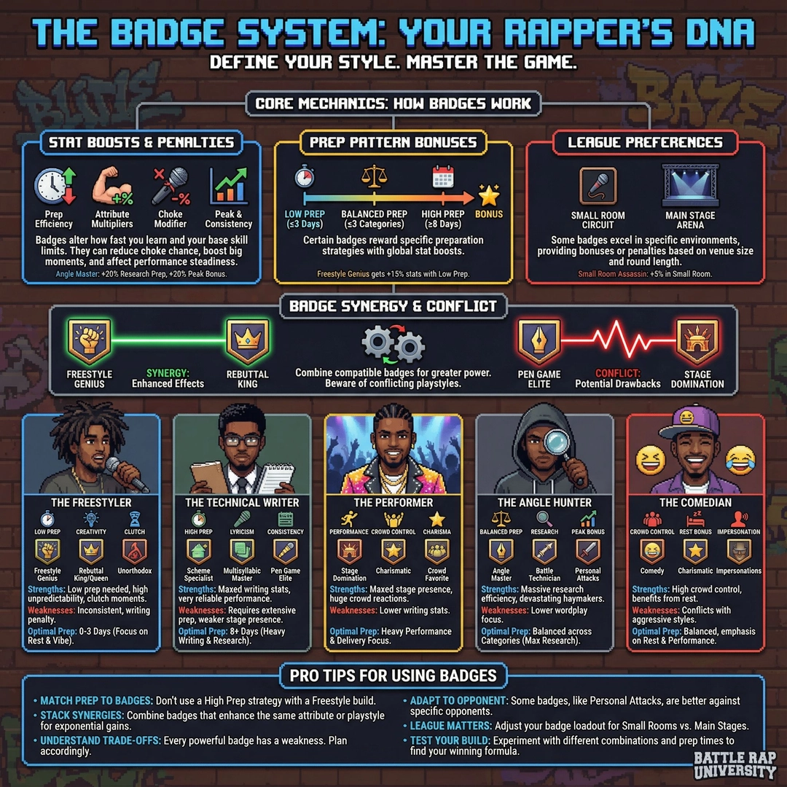

# Battle Rap University

<div align="center">
  

  **Finally, a battle rap game that actually gets it.**

  *Made BY battle rap fans FOR battle rap fans.*

  [](https://x.com/BattleRapAI)
  [](https://www.youtube.com/@AlgorithmInstituteofBR)
</div>

---

## What Is This?

Battle Rap University is a **battle rap simulation and strategy game** where you manage and develop battle rappers. No writing bars required - it's pure chess. Every decision matters.

- **Manage your battler's prep, strategy, and career**
- **Segment-based battle simulation** (not lyric writing)
- **AI opponents** with unique styles and strategies
- **Dynamic media system** with AI-generated battle recaps
- **17 unique leagues** across 4 tiers

<div align="center">
  
  
</div>

---

## Features

<table>
  <tr>
    <td align="center" width="25%">
      <br/>
      <strong>Authentic Battle Rap</strong><br/>
      <sub>3 Rounds, No Beat, Real Terminology</sub>
    </td>
    <td align="center" width="25%">
      <br/>
      <strong>Deep Strategy</strong><br/>
      <sub>Prep Management, Badge Synergies</sub>
    </td>
    <td align="center" width="25%">
      <br/>
      <strong>Unpredictable Battles</strong><br/>
      <sub>Chokes Happen, Debatable Decisions</sub>
    </td>
    <td align="center" width="25%">
      <br/>
      <strong>Build Your Legacy</strong><br/>
      <sub>Rookie to Legend, Small Room to Main Stage</sub>
    </td>
  </tr>
</table>

### Dominate Your City

Become the best in New York, Philadelphia, Atlanta, or wherever you rep. Rise through your local scene before conquering the national stage.

<div align="center">
  
  
  
</div>

### 16+ Unique Venues

Adapt your performance to each venue. Small rooms demand intimacy, main stages require presence. Master them all.

<div align="center">
  
</div>

### Master the Badge System

60+ badges to unlock. Define your style and build synergies.

<div align="center">
  
</div>

---

## Game Mechanics

### Attribute System (1-10 Scale)

| Category | Attributes |
|----------|------------|
| **Writing** | Lyricism, Wordplay, Creativity, Flow |
| **Performance** | Stage Presence, Crowd Control, Delivery |
| **Personal** | Financial Stability, Reputation, Family Bond, Preparation |
| **Mental** | Resilience (ability to handle pressure) |

### Battle Simulation

Battles are **segment-based**, not bar-based. Each round is divided into 30-second segments:
- 2-min rounds = 4 segments
- 3-min rounds = 6 segments

Each segment calculates:
- **Average Score** - Mean performance across the segment
- **Peak Score** - The "haymaker" moment
- **Consistency** - How reliable you are
- **Crowd Reaction** - How the audience responds
- **Choke Risk** - Based on resilience + prep (yes, chokes happen!)

### League Tiers

| Tier | Description | Examples |
|------|-------------|----------|
| **Underground** | Raw, unfiltered battles | Underground Kings, Bar God, The Pit |
| **Regional** | Established local scenes | Small Room Circuit, G.U.N., City Beatz |
| **National** | Premier competition | Respect The Craft, Royal Rhyme |
| **Premier** | The biggest stages | Main Stage, Global Word War |

### Prep System

Choose your daily focus leading up to battles:
- **Research** - Better angles and rebuttals
- **Writing** - Boost lyricism, wordplay, creativity
- **Performance** - Improve stage presence and delivery
- **Rest** - Buffer resilience, reduce choke risk
- **Life** - Handle personal matters, trigger life events

---

## Tech Stack

- **Frontend**: Next.js 15 (App Router) + React + TypeScript
- **Backend**: Next.js API Routes + Supabase (Postgres + Auth)
- **Styling**: TailwindCSS with custom dark theme
- **AI Content**: LLM-powered battle recaps and news articles
- **Local Dev**: Docker + Supabase CLI

---

## Getting Started

### Prerequisites

- Node.js 18+
- Docker Desktop (for local Supabase)
- pnpm/npm/yarn

### Installation

```bash
# Clone the repository
git clone https://github.com/yourusername/battlerapuniversity.git
cd battlerapuniversity

# Install dependencies
npm install

# Start local Supabase (requires Docker)
npm run supabase:start

# Apply migrations and seed data
npm run supabase:reset

# Start the dev server
npm run dev
```

Visit `http://localhost:3000` to play!

### Environment Variables

Create a `.env.local` file:

```env
NEXT_PUBLIC_SUPABASE_URL=http://127.0.0.1:54321
NEXT_PUBLIC_SUPABASE_ANON_KEY=your-anon-key
SUPABASE_SERVICE_ROLE_KEY=your-service-key
```

---

## Project Structure

```
battlerapuniversity/
├── app/                    # Next.js App Router pages
│   ├── (dashboard)/        # Main game dashboard
│   ├── api/                # API routes
│   ├── battle/             # Battle pages (prep, results)
│   ├── dev/                # Dev tools (battler/league editors)
│   └── media/              # News/blog system
├── components/             # React components
├── lib/
│   ├── db/                 # Supabase clients
│   ├── game/               # Game logic (simulation, progression)
│   ├── leagues.ts          # 17 leagues data
│   ├── bloggers.ts         # 8 blogger personalities
│   └── services/           # AI content generation
├── public/
│   ├── images/             # Landing page assets
│   └── sprites/            # Character sprites, badges, venues
└── supabase/
    ├── migrations/         # Database migrations
    └── seed.sql            # Initial data
```

---

## Current Status

### Implemented
- Character creation with attribute allocation
- Battle offer generation and acceptance
- Prep planning with calendar UI
- Segment-based battle simulation
- Battle results viewer with timeline
- Attribute progression based on performance
- Life events system
- AI-generated news articles
- Dev tools for editing battlers, leagues, bloggers

### In Progress
- Badge earning system (97 badges designed)
- XP/Level career progression
- Multiplayer battles

### Planned
- Mobile-responsive improvements
- Achievement system
- Tournament mode
- League commissioner features

---

## Contributing

This is currently a solo passion project in active development. If you're interested in contributing, reach out on [Twitter/X](https://x.com/BattleRapAI).

---

## License

All rights reserved. This is proprietary software.

---

<div align="center">
  <strong>Algorithm Institute of Battle Rap © 2025</strong>
  <br/><br/>
  <em>"Where legends are made, one round at a time."</em>
</div>
